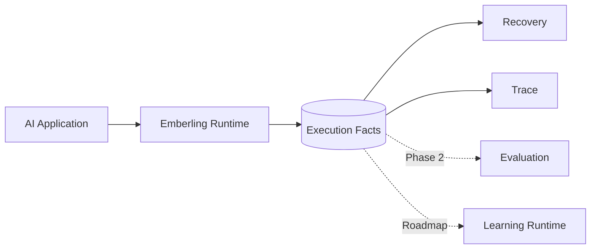
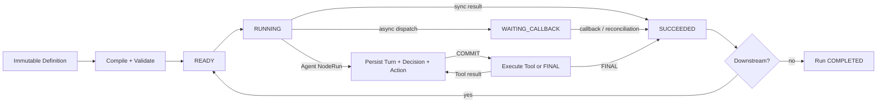
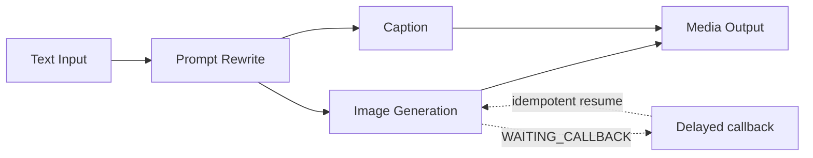
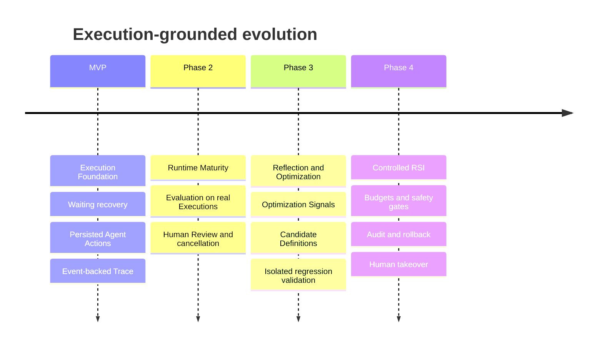

# Emberling

> **Every execution leaves an ember.**  
> Emberling preserves those embers as durable execution facts—so interrupted work can recover and every run can become evidence for what comes next.

**An AI-native Execution Runtime for long-running applications.**

Emberling runs stateful AI applications across model calls, Tool actions, external callbacks and process restarts. It is not an AI workflow tool: the Studio is only a thin development surface over the Runtime.

[中文](./README.zh-CN.md) · [Vision](./docs/00-vision.md) · [Architecture](./docs/03-architecture.md) · [Execution model](./docs/06-execution-model.md) · [Roadmap](./docs/12-roadmap.md)


---

## Execution facts are the product

Emberling records what actually happened—not a reconstruction from logs. Definition versions, state transitions, Attempts, model Decisions, Tool Actions and Events form one durable execution ledger.



| Recover now | Understand now | Improve later |
|---|---|---|
| Resume persisted work after callbacks and restarts | Inspect the same facts that drive the Runtime | Evaluate candidate versions on ordinary Executions |

---

## Why Emberling exists

Calling a model is an API problem. Operating a long-running AI application is a systems problem.

| The workload | The execution problem |
|---|---|
| Model and Tool calls | Timeouts, retries, cost and uncertain outcomes |
| External generation jobs | Suspend, callback, resume and restart recovery |
| Agent decisions | Persist the Decision before performing the Action |
| Business side effects | Idempotency, auditability and explicit failure boundaries |
| Continuous improvement | Evaluate from real execution evidence, not synthetic traces |

In-memory orchestration and application logs lose authority at exactly the moment reliability matters: a process restarts, a callback arrives twice, or an external request has an ambiguous result.

---

## A different layer

Emberling sits between AI frameworks and infrastructure primitives.

| | AI workflow / agent framework | General durable engine | Emberling |
|---|---|---|---|
| Primary concern | Compose model and Tool calls | Execute arbitrary durable programs | Execute long-running AI applications |
| Native facts | Messages, steps or graph state | Workflow history | Run, NodeRun, Attempt, Decision, Action and Event |
| Agent recovery | Often process-local | Application-defined | Persisted Turn, Decision and Action boundaries |
| AI observability | Added through tracing | Domain-agnostic | Derived from the execution ledger |
| Learning path | Usually separate | Outside product scope | Evaluation and learning consume ordinary Executions |

Emberling does not replace Temporal, and it does not compete on node catalogs. Its focus is the AI-native execution layer between application definitions and external systems.

---

## How it works

Workflow and Agent semantics share one execution core.



Every transition follows one boundary:

```text
persist state + Event  →  COMMIT  →  execute external work / publish SSE
```

PostgreSQL is the source of Emberling-owned execution facts. Reconciliation rediscovers persisted `READY` work; immediate post-COMMIT execution is only the fast path.

---

## What the MVP proves

The MVP is deliberately narrow. If a feature does not strengthen or validate the execution layer, it does not belong.

| Synchronous baseline | Async recovery | Persisted Agent loop |
|---|---|---|
| **Document Processing** | **AIGC Media Generation** | **Agent Tool Loop** |
| Deterministic scheduling, data flow and Event-backed Trace | Dispatch, suspend, callback idempotency and Backend restart recovery | Persisted Decision/Action, sync and async Tools, Context/State and per-turn recovery |



The signature milestone is simple to state and hard to fake:

> Suspend an external task, restart the Backend, accept the callback, resume the same Execution, and finish the graph without duplicating progress.

---

## An honest durability boundary

| The MVP guarantees | The MVP does not claim |
|---|---|
| `WAITING_CALLBACK` survives Backend restart | Recovery of an in-flight synchronous call |
| Persisted `READY` work is rediscovered | Exactly-once external side effects |
| Repeated and stale callbacks cannot advance twice | Strict dispatch consistency across database and Provider |
| A committed Agent Decision is never regenerated | Recovery across incompatible Runtime implementations |

This is waiting recovery with explicit side-effect boundaries—not a claim of general durable execution.

---

## Where Emberling is going

Execution remains the foundation at every stage. Learning happens between Executions and never rewrites a running Run.



Recursive self-improvement is a bounded capability level, not a slogan. A change only advances when ordinary Executions provide evidence that it improves quality without violating safety, cost or side-effect constraints.

---

## Explore the design

| Start here | Go deeper |
|---|---|
| [Product vision](./docs/00-vision.md) | [Persistent data and Event model](./docs/05-data-model.md) |
| [MVP scope](./docs/02-scope.md) | [Execution, suspend and resume](./docs/06-execution-model.md) |
| [System architecture](./docs/03-architecture.md) | [Testing and acceptance](./docs/09-testing-and-acceptance.md) |
| [Roadmap](./docs/12-roadmap.md) | [Architecture decisions](./docs/11-decisions.md) |

**Project stage:** Runtime design contracts are complete; implementation is next.  
**Target stack:** Go · PostgreSQL · React · TypeScript · React Flow
