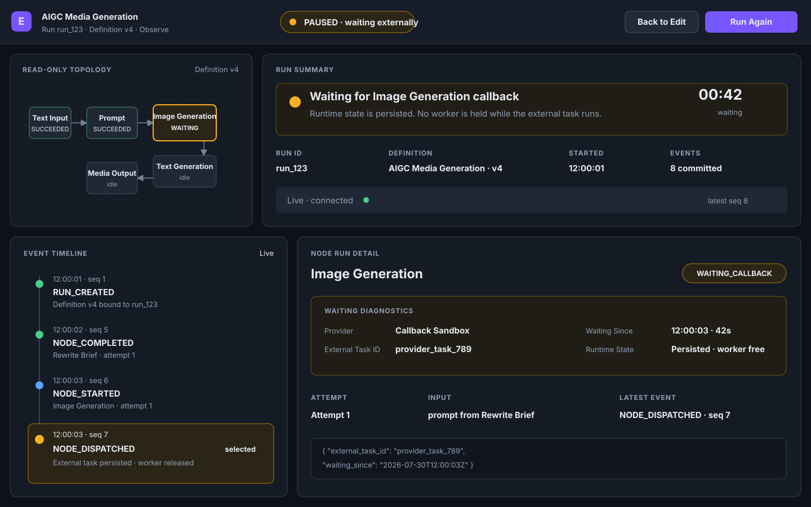
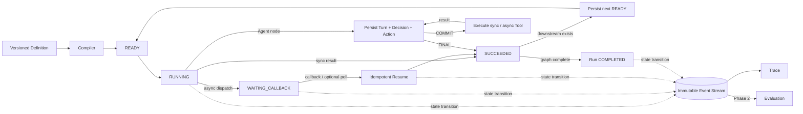

# Emberling

### The execution layer for long-running AI applications

Emberling is an **Agent Runtime Platform** for stateful, side-effecting, long-running AI applications. It turns an application definition into a durable Execution, persists every state transition, coordinates asynchronous work, and emits an immutable event stream for Trace and future Evaluation.

> **Build the execution layer that long-running AI applications are missing.**

**Project stage:** core design complete through the Runtime specification; implementation is next.  
**Target stack:** Go · PostgreSQL · React · TypeScript · React Flow  
**Language:** [中文](./README.zh-CN.md)



## Why Emberling

Calling a model is an API integration problem. Operating a multi-step AI application is a systems problem.

Long-running AI workloads cross process boundaries, wait for external callbacks, retry expensive operations, produce business side effects, and must remain explainable after failures. Most prototypes solve this with in-memory orchestration and logs. That breaks as soon as a process restarts or an external task completes out of order.

Emberling is designed as an **execution substrate**, not another node canvas:

- **Durable control plane** — Run, NodeRun, Attempt and Event state live in PostgreSQL, not worker memory.
- **Reconciliation-driven liveness** — persisted `READY` work is rediscovered after restart; callback recovery is not the only recovery path.
- **Side-effect-aware execution** — retry decisions respect idempotency and ambiguous external outcomes.
- **Execution-native observability** — Trace is derived from the same immutable event ledger that drives the Runtime.
- **Evaluation on real runs** — future Evaluation consumes ordinary Executions instead of maintaining a second test executor.

## Product position

Emberling is a Runtime, not a Workflow Builder. In the long term, Workflow Studio, DSL, SDK and API are equal authoring surfaces over the same Execution model. The MVP ships the minimal Studio and its Backend API; a standalone SDK is Phase 2.

It also does not attempt to replace Temporal. Temporal provides general-purpose durable execution. Emberling focuses on AI-native semantics and developer experience: `LLM Call`, `Tool Call`, `Agent Step`, Token, Cost, Evaluation, Human Review, execution Trace and behavior-level debugging.

The MVP combines a human-authored static DAG with a managed, persisted Agent Loop inside an `Agent` NodeRun. The Agent may choose a Tool but cannot rewrite the Workflow graph.

## Runtime architecture



Every transition follows the same contract:

1. Persist state and the corresponding Event in one PostgreSQL transaction.
2. Commit.
3. Publish SSE and perform node or Provider work outside the transaction.

This boundary keeps the database transaction free of irreversible network side effects.

## Core engineering contracts

| Property | Contract |
|---|---|
| Execution source of truth | PostgreSQL owns Definition, Asset metadata, Workflow and Agent execution facts, callback bindings and Events |
| Immutable execution input | Every Run binds a Definition version or snapshot |
| Aggregated Run state | A NodeRun cannot directly force the Run into `PAUSED` |
| Idempotent recovery | Callback and optional Provider reconciliation converge on one `resume` use case |
| Recoverable progress | Immediate post-COMMIT execution is a fast path; reconciliation can rediscover persisted `READY` work |
| Recoverable Agent actions | A committed Decision is never regenerated; reconciliation can rediscover its persisted `READY` Action |
| Event-backed Trace | State and Event commit atomically; SSE publishes committed Events only |
| Extensible core | Nodes and Model Providers implement ports; Runtime scheduling does not contain vendor branches |

### Honest durability boundary

The MVP proves **waiting recovery**:

- `WAITING_CALLBACK` survives a Backend restart.
- callback or optional Provider polling resumes the same persisted NodeRun.
- downstream `READY` work is rediscovered if the Backend crashes after COMMIT.
- a committed Agent Action is rediscovered after restart without generating a second Decision.

The MVP does **not** claim general durable execution. Recovery of an in-flight `RUNNING` call, strict dispatch consistency, distributed leasing, exactly-once external side effects and recovery across incompatible Runtime implementation versions remain roadmap work.

## MVP

The MVP is deliberately narrow. If a feature does not strengthen or validate the execution layer, it does not belong.

### Runtime

- Static DAG compilation and validation
- Deterministic sequential scheduling
- Run, NodeRun and Attempt persistence
- Timeout, retry and failure propagation
- Asynchronous dispatch, suspend and idempotent resume
- Required local `READY` reconciliation
- Immutable Event stream and SSE Trace
- Managed Agent Run, Turn, Decision and Action facts
- One deterministic read-only Tool and one callback-based async Tool
- Recovery of committed Agent Actions and waiting Tool Attempts

### Studio

- Eight registered nodes across Input, Prompt & Model, Agent and Output categories
- Handler-driven registration: sync/async Executors plus a managed Agent Runtime
- Typed ports, schema-driven configuration, media previews and runtime contract visibility
- Definition editing, validation and Run creation
- Immutable `AssetRef` for the optional Reference Image
- Live Run and NodeRun state
- Event timeline, Node detail, input/output, latency, Token usage and errors

### Proof scenarios

| Scenario | What it proves |
|---|---|
| Document Processing | synchronous baseline, data flow, state transitions and Trace |
| AIGC Media Generation | external dispatch, persistent suspend, callback recovery, idempotency and restart recovery |
| Agent Tool Loop | persisted Decision/Action, sync and async Tools, Context/State and per-turn recovery |

The AIGC flow is the signature demo:

```text
Text Input → Prompt Template → Prompt Rewrite ─┬→ Image Generation ─┐
                                               │         ↑           │ image
                                               │  Image Input        ↓
                                               └→ Caption ─────→ Media Output
```

The first integration can use a delayed callback simulator. A real image API is optional; the Runtime contract must remain identical.

## Evolution path

| Stage | Direction |
|---|---|
| MVP | waiting recovery, persisted Agent actions, side-effect boundary, execution Trace |
| Phase 2 | parallel execution, Tool/HTTP/Condition/Human Review, cancellation, streaming, Evaluation |
| Roadmap | dynamic DAGs, Planner/Multi-Agent, Replay, Session/Long-term Memory, distributed Workers, stronger dispatch guarantees |

Evaluation remains attached to the Runtime:

```text
Dataset → ordinary Execution → Event-backed Trace → Evaluator → Compare / Regression
```

No separate evaluation executor. No synthetic trace reconstructed after the fact.

## Design documentation

| Document | Responsibility |
|---|---|
| [Vision](./docs/00-vision.md) | product position and long-term principles |
| [Scenarios](./docs/01-scenarios.md) | MVP validation scenarios |
| [Scope](./docs/02-scope.md) | MVP source of truth |
| [Architecture](./docs/03-architecture.md) | system boundaries and global invariants |
| [Studio & Trace UX](./docs/04-ux.md) | external product experience |
| [Data & Event Model](./docs/05-data-model.md) | persistent facts and execution ledger |
| [Execution Model](./docs/06-execution-model.md) | scheduling, suspend/resume and reconciliation |
| [Extensibility & Evaluation](./docs/07-extensibility.md) | extension ports and post-MVP consumers |
| [Interface contracts](./docs/08-interface-spec.md) | Definition, REST, callback, SSE and error boundaries |
| [Testing & acceptance](./docs/09-testing-and-acceptance.md) | invariant tests, failure matrix and MVP DoD |
| [Operations & security](./docs/10-ops.md) | deployment, Secrets, Asset storage and recovery operations |
| [Architecture decisions](./docs/11-decisions.md) | current decisions and consequences |
| [Roadmap](./docs/12-roadmap.md) | post-MVP stages and success metrics |

## Status

Emberling is currently a design-first engineering project. The Runtime contracts, MVP boundary and core execution model are specified; production code and demos have not started.

The first hard implementation milestone is not “draw and run a graph.” It is:

> suspend an external task, restart the Backend, accept the callback, recover the Execution, and finish the downstream graph without duplicating progress.

The next milestone applies the same discipline inside the Agent Loop: commit a Decision and Action, restart, then execute the original Action without asking the model for a second Decision.
