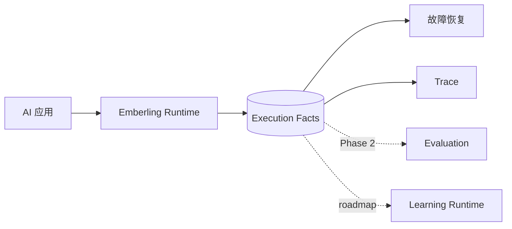
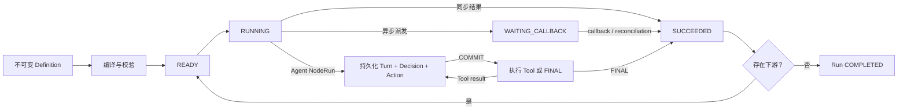
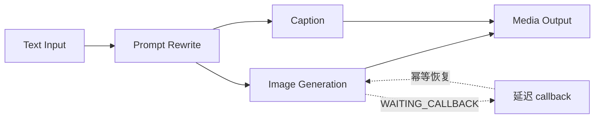
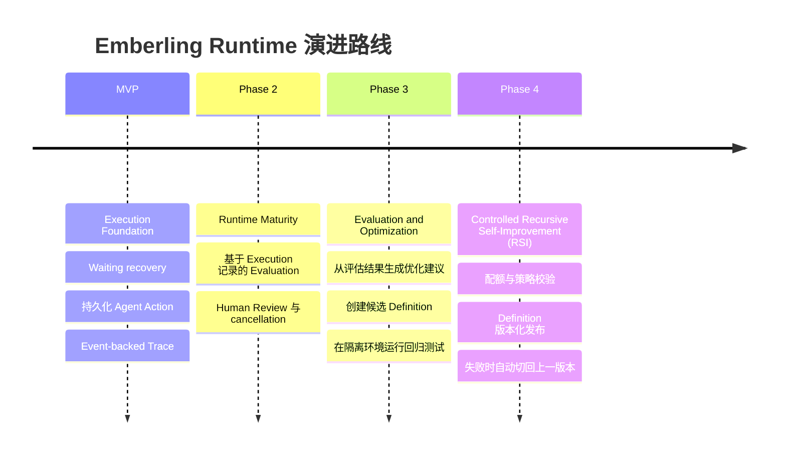

# Emberling

**Emberling 是面向长时间运行 AI 应用的 AI-native Execution Runtime。**

它将 Workflow 和 Agent 的执行过程保存为持久化事实，让中断后的任务能够从已提交的状态继续，并留下可查询的决定、动作和结果。

当 Agent 需要运行代码、执行 Shell 或操作文件时，还需要隔离的运行环境。Emberling 管理逻辑执行，外部 Sandbox 承载代码执行；AX 是这一 roadmap 方向的首个验证对象。

```text
Emberling = durable logical execution
AX        = isolated physical execution
```

Emberling 让 Agent 的逻辑执行持久化；AX 提供隔离的运行环境，并在挂起时保留工作目录。

[English](./README.md)


> **每次执行都会留下一点火种。**
>
> Emberling 将它们沉淀为持久化执行事实——为故障恢复保留现场，也为系统演进积累证据。

---

## Execution Facts 就是产品核心

Emberling 记录真实发生的执行过程，而不是事后从日志中推测。Definition 版本、状态变化、Attempt、模型 Decision、Tool Action 和 Event 共同构成一份持久化执行账本。



| 恢复执行 | 理解执行 | 改进系统 |
|---|---|---|
| callback 或重启后从持久化状态继续 | 查看 Runtime 推进时使用的同一份事实 | 用普通 Execution 验证候选版本 |

---

## 为什么需要 Emberling

调用模型是 API 集成问题。可靠运行长时间 AI 应用是系统工程问题。

| 真实负载 | 执行层问题 |
|---|---|
| 模型与 Tool 调用 | timeout、retry、成本和结果不确定性 |
| 外部生成任务 | 挂起、callback、恢复和进程重启 |
| Agent 动态决策 | 执行 Action 前必须先持久化 Decision |
| 业务副作用 | 幂等、审计和明确的失败边界 |
| 持续改进 | 依据真实执行证据评估，而不是依赖合成 Trace |

内存编排和应用日志在最需要可靠性的时刻失去权威：进程突然重启、callback 重复到达，或者外部请求结果无法确认。

---

## Emberling 所在的层

Emberling 位于 AI Framework 与底层通用执行基础设施之间。

| | AI Workflow / Agent Framework | 通用 Durable Engine | Emberling |
|---|---|---|---|
| 首要目标 | 组合模型和 Tool 调用 | 持久化执行任意程序 | 运行长时间 AI 应用 |
| 原生事实 | 消息、Step 或 Graph State | Workflow History | Run、NodeRun、Attempt、Decision、Action 和 Event |
| Agent 恢复 | 通常依赖进程内状态 | 由应用自行定义 | Turn、Decision 和 Action 均有持久化边界 |
| AI 可观测性 | 通过额外 Trace 接入 | 不理解业务语义 | 直接来自执行账本 |
| 学习路径 | 通常独立建设 | 不属于产品范围 | Evaluation 与 Learning 消费普通 Execution |

Emberling 不替代 Temporal，也不靠节点数量竞争。它专注于应用定义与外部系统之间缺失的 AI 原生执行层。

---

## 它怎样运行

Workflow 与 Agent 语义共用同一个执行内核。



所有状态推进遵循同一条边界：

```text
持久化状态与 Event  →  COMMIT  →  执行外部工作 / 发布 SSE
```

PostgreSQL 是 Emberling 自有执行事实的持久化来源。Reconciler 负责重新发现已经提交的 `READY` 工作；COMMIT 后立即推进只是快速路径。

---

## MVP 要证明什么

MVP 刻意保持狭窄。不能强化或验证执行层的能力，不进入当前交付范围。

| 同步基线 | 异步恢复 | 持久化 Agent Loop |
|---|---|---|
| **Document Processing** | **AIGC Media Generation** | **Agent Tool Loop** |
| 确定性调度、数据传递和 Event-backed Trace | 派发、挂起、callback 幂等和 Backend 重启恢复 | Decision/Action 持久化、同步与异步 Tool、Context/State 和逐轮恢复 |



MVP 的标志性里程碑很容易描述，却很难伪造：

> 派发外部任务并挂起，重启 Backend，接收 callback，恢复同一个 Execution，并在不重复推进的情况下完成后续执行。

---

## 不夸大的可靠性边界

| MVP 保证 | MVP 不承诺 |
|---|---|
| `WAITING_CALLBACK` 可以跨 Backend 重启保留 | 恢复执行中的同步调用 |
| 持久化 `READY` 工作一定会被重新发现 | exactly-once 外部副作用 |
| 重复和过期 callback 不能推进两次 | 数据库与 Provider 之间的严格 dispatch 一致性 |
| 已提交的 Agent Decision 不会重新生成 | 跨不兼容 Runtime 实现恢复 |

这是具有明确副作用边界的 waiting recovery，不是对通用 durable execution 的过度承诺。

---

## 演进路线

隔离执行扩展 AI 应用能够完成的任务，同时将决定、动作和结果保留在 Emberling 的执行账本中。AX 接入仍属 roadmap 实验，尚未作为 MVP 能力交付。

后续能力继续复用同一套 Execution Runtime。系统可以根据已完成的 Run 生成新的候选 Definition，但已经启动的 Run 始终使用创建时绑定的版本，不受后续配置变更影响。



Recursive Self-Improvement（RSI）仍然走标准的版本化发布流程：每轮优化生成一个新的 Definition，使用独立 Execution 完成评估和回归测试，达标后只对新建 Run 生效；正在执行的 Run 继续使用原版本。

---

**项目阶段：** Runtime 设计合同已经完成，下一步进入实现。  
**目标技术栈：** Go · PostgreSQL · React · TypeScript · React Flow
