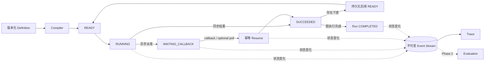

# Emberling

### 面向长时间运行 AI 应用的执行层

Emberling 是一个 **Agent Runtime Platform**，用于承载有状态、有副作用、长时间运行的 AI 应用。它将应用定义转换为持久化 Execution，保存每次状态变化，协调异步任务，并生成不可变 Event Stream，供 Trace 和后续 Evaluation 使用。

> **Build the execution layer that long-running AI applications are missing.**

**项目阶段：** Runtime 核心设计已经完成，下一步进入实现。  
**目标技术栈：** Go · PostgreSQL · React · TypeScript · React Flow  
**Language:** [English](./README.md)


## 为什么是 Emberling

调用模型是 API 集成问题。运行多步骤 AI 应用是系统工程问题。

长时间运行的 AI 任务会跨越进程边界，等待外部 callback，重试昂贵操作，产生业务副作用，并且需要在故障后解释真实执行过程。大量原型仍依赖内存编排和日志；一旦进程重启、callback 乱序或外部调用结果不确定，执行链就会失去可靠状态。

Emberling 的目标是构建 AI 应用的 **Execution Substrate**，而不是再做一个节点画布：

- **持久化控制面**：Run、NodeRun、Attempt 和 Event 存在 PostgreSQL 中，不依赖 Worker 内存。
- **协调驱动的执行活性**：Backend 重启后重新发现持久化 `READY` 工作；恢复能力不只依赖 callback。
- **副作用感知执行**：重试策略必须理解幂等性和外部调用的模糊结果。
- **执行原生可观测性**：Trace 来自 Runtime 使用的同一份不可变事件账本。
- **基于真实运行的评估**：后续 Evaluation 消费普通 Execution，不维护第二套测试执行器。

## 产品定位

Emberling 是 Runtime，不是 Workflow Builder。Workflow Studio、DSL、SDK 和 API 只是同一种 Execution Model 的不同开发入口。

Emberling 也不试图替代 Temporal。Temporal 提供通用 durable execution；Emberling 关注 AI 原生执行语义和开发体验，包括 `LLM Call`、`Tool Call`、`Agent Step`、Token、Cost、Evaluation、Human Review、Execution Trace 和行为级调试。

长期产品是 AI Application Runtime。静态 DAG 是 MVP 的验证载体，不是最终抽象。

## Runtime 架构



每次状态推进遵循同一条事务契约：

1. 在一个 PostgreSQL 事务中保存状态和对应 Event。
2. COMMIT。
3. 在事务外发布 SSE、执行节点或调用 Provider。

这个边界避免在数据库事务中执行不可回滚的网络副作用。

## 核心工程契约

| 能力 | 契约 |
|---|---|
| Execution 事实源 | PostgreSQL 保存 Definition、Run、NodeRun、Attempt 和 Event |
| 不可变执行输入 | 每个 Run 绑定 Definition 版本或快照 |
| Run 状态聚合 | 单个 NodeRun 不能直接把 Run 置为 `PAUSED` |
| 幂等恢复 | callback 与 optional Provider reconciliation 汇入同一个 `resume` 用例 |
| 可恢复推进 | COMMIT 后即时执行只是快速路径；Reconciler 可以重新发现持久化 `READY` 工作 |
| Event 驱动 Trace | 状态和 Event 同事务提交；SSE 只发布已提交 Event |
| 可扩展内核 | Node 和 Model Provider 实现扩展端口；调度核心不包含厂商分支 |

### 诚实的 durable 边界

MVP 证明的是 **waiting recovery**：

- `WAITING_CALLBACK` 可以跨 Backend 重启保留。
- callback 或 optional Provider poll 恢复同一个持久化 NodeRun。
- Backend 在 COMMIT 后崩溃时，下游 `READY` 工作仍能被重新发现。

MVP 不宣称完整的通用 durable execution。执行中的 `RUNNING` 调用恢复、严格 dispatch 一致性、分布式 lease 和 exactly-once 外部副作用仍属于 roadmap。

## MVP

MVP 刻意保持狭窄。不能强化或验证执行层的能力，不进入 MVP。

### Runtime

- 静态 DAG 编译和校验
- 确定性的顺序调度
- Run、NodeRun 和 Attempt 持久化
- Timeout、retry 和失败传播
- 异步派发、挂起与幂等恢复
- 必需的本地 `READY` reconciliation
- 不可变 Event Stream 与 SSE Trace

### Studio

- 五个节点：`Input`、`Prompt Template`、`LLM`、`Async Task`、`Output`
- Definition 编辑、校验和 Run 创建
- 实时 Run 与 NodeRun 状态
- Event 时间线、Node Detail、输入输出、耗时、Token usage 和错误

### 验证场景

| 场景 | 验证能力 |
|---|---|
| Document Processing | 同步基线、数据传递、状态流转和 Trace |
| AIGC Media Generation | 外部派发、持久化挂起、callback 恢复、幂等和重启恢复 |

AIGC 流程是 MVP 的标志性演示：

```text
Input → Prompt Rewrite → Image Task
                          ↓ callback
        Output ← Caption ← Resume
```

首个集成可以使用延迟 callback 模拟服务。真实图像 API 为 optional；Runtime 契约不能因此改变。

## 演进方向

| 阶段 | 方向 |
|---|---|
| MVP | waiting recovery、状态恢复、副作用边界、Execution Trace |
| Phase 2 | 并行执行、Tool/HTTP/Condition/Human Review、取消、流式输出、Evaluation |
| Roadmap | 动态 Agent Step、Replay、Session/Long-term Memory、分布式 Worker、更强 dispatch 保证 |

Evaluation 必须依附 Runtime：

```text
Dataset → 普通 Execution → Event-backed Trace → Evaluator → Compare / Regression
```

不建设独立评估执行器，也不在执行结束后伪造 Trace。

## 设计文档

| 文档 | 职责 |
|---|---|
| [产品愿景](./docs/00-vision.md) | 产品定位与长期原则 |
| [验证场景](./docs/01-scenarios.md) | MVP 验证场景 |
| [项目范围](./docs/02-scope.md) | MVP 单一事实来源 |
| [系统架构](./docs/03-architecture.md) | 系统边界与全局不变量 |
| [Studio 与 Trace UX](./docs/04-ux.md) | 对外产品体验 |
| [数据与事件模型](./docs/05-data-model.md) | 持久化事实与执行账本 |
| [执行模型](./docs/06-execution-model.md) | 调度、挂起恢复与 reconciliation |
| [扩展与 Evaluation](./docs/07-extensibility.md) | 扩展端口与后续消费者 |

## 当前状态

Emberling 当前是一个设计先行的工程项目。Runtime 契约、MVP 边界和核心执行模型已经明确；生产代码和 Demo 尚未开始。

第一个实现里程碑不是“画一张图并运行”，而是：

> 派发外部任务并挂起，重启 Backend，接收 callback，恢复 Execution，并在不重复推进的情况下完成后续 DAG。
